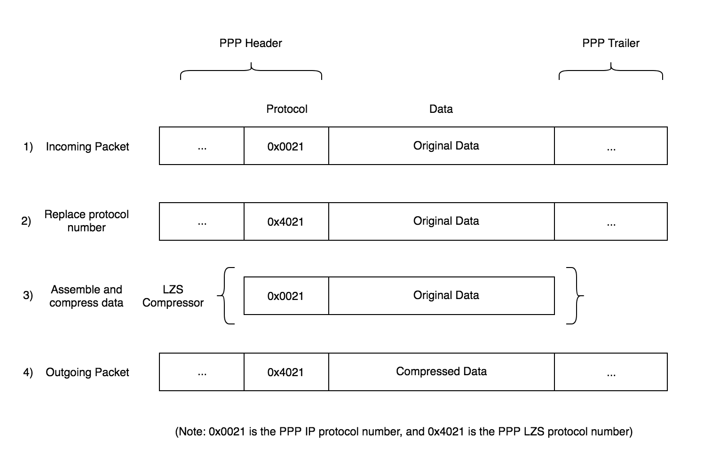
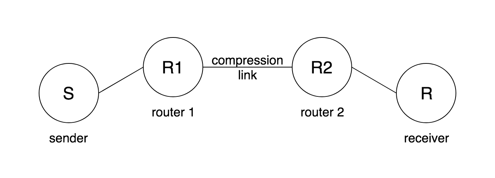

# Transport-Layer-Security-TLS-Protocol-Compression
The Transport Layer Security (TLS) protocol includes features to negotiate selection of a lossless data compression method as part of the TLS Handshake Protocol and then to apply the algorithm associated with the selected method as part of the TLS Record Protocol. See [buildbot](http://buildbot.tools.ietf.org)

## Project description
    
### Project outcomes
    
   1. Enable network compression for point-to-point links in ns-3.
   2. Implement the network application that detects the presence of network compression by end-hosts.
   3. Verify and validate your simulated compression link and compression detection application

### Overview
    
For this project implementation of a network level compression link is considered. We implement then a network application to detect whether network compression is present to validate your simulated compression link. It is inspired by the work, End-to-End Detection of Compression of Traffic Flows by Intermediaries [PointToPoint](https://lasr.cs.ucla.edu/vahab/resources/compression_detection.pdf).
Crucial to success in this project will be a deep and detailed reading and understanding of the ns-3 documentation, where it is relevant to your project. Among the ns-3 documentation [nsnm](https://www.nsnam.org/releases/ns-3-29/documentation/) are tutorials, a reference manual, a model library, and a full API reference. You should explore and make use of all of these resources.

### Components
   
#### (1) Compression Link
   
The compression link application must be built using ns-3. It will be responsible for compression and decompression of incoming and outgoing packets. We will use the Lempel-Ziv-Stac algorithm for compression and decompression, for which you may find and use a library. Your compression link should follow some requirements in the RFC 1974: PPP Stac LZS Compression Protocol.
Specifically, we implemented functionality that takes a PPP packet, and first checks the protocol number in the header. You should also have a configuration file that specifies packet types to compress. If we determine that the checked packet type matches one in the configuration file, we pre-process then compress it. For the purposes of this project, the configuration file will only have one protocol entered, IP, protocol number 0x0021.
Pre-processing should first take the matched packet then replace the original protocol number with the LZS protocol number, 0x4021. It should then take the original protocol number and append it to the original data, and compress that whole bitstring and replace it with the original data section in the original packet, as illustrated in Figure 1. Decompressor, at the other side of the compression link, should then reverse all the pre-processing steps performed at the compressor, to retrieve the original incoming packet ((1) in Figure 1), before pushing it to the next interface.
You should not worry about implementing Compression Control Protocol and its corresponding control packets, as you may assume the two routers have already reached an Opened state and LZS has been negotiated as the primary compression algorithm. Similarly, you should also not implement anything from the negotiation phase, and not worry about using the exact compression data format, specified in X3.241-1994.
You may only need to modify PointToPointNetDevice to enable compression/decompression on point-to-point links. A good starting point to get familiar with, in addition to PointToPointNetDevice is the ns-3 point-to-point model overview.



Figure 1: The specified method to implement for assembling compressed packets, as specificed in RFC 1974.
A good starting point for building ns-3 applications might be this ns-3 wiki article, How To Make and Use A New Application.
  
   
   
#### (2) Compression Detection Application

We implemented the network compression detection only in the cooperative environment as described here (Section IV). In summary, your network application is a client/server application where the sender sends two sets of 6000 UDP packets back-to-back (called packet train), and the receiver records the arrival time between the first and last packet in the train. The first packet train consists of all packets of size 1100 bytes in payload, filled with all 0’s, while the second packet train contains random sequence of bits. You can generate random sequence of bits using /dev/random. If the difference in arrival time between the first and last packets of the two trains (∆tH −∆tL) is more than a fixed threshold τ = 100 ms, the application reports *Compression detected!*, whereas when the time difference is less than τ there was probably no compression link on the path and the application should display *No compression was detected*.
Your application is required to take in at least one command-line argument, Compression Link Capacity, which specifies the maximum bandwidth across the link between the two routers.

#### (3) Simulation Veriftcation and Validation

Create a 4-node topology in ns-3 as illustrated in Figure 2. Nodes S and R are the end-hosts running the network application. Nodes R1 and R2 are the intermediate routers where the link between them is compression-enabled. Your simulations should also be built using ns-3. You should include four logically separate simulations, each doing one of the following:
Transmit low entropy data over a network topology without a compression link.



                              Figure 2: A 4-node topology with a compression link.

Transmit high entropy data over a network topology without a compression link.
Transmit low entropy data over a network topology with a compression link.
Transmit high entropy data over a network topology with a compression link.

We then vary the middle link (R1R2) capacity parameter from 1,2,3,...,10 Mbps, reporting each ∆tH − ∆tL. The link capacity of the two outer (non compression) links on your four node topology should be set persistently to 8 Mbps.
Make sure you are careful to control for confounding variables across your four simulations, as you will ultimately be comparing time between these four simulation types so as to try and detect the compression link.

## Requirements

In order to run this project you need install Virtual Box (Oracle), version 6.0. 

### Operating System

The project is running under Ubuntu, version 18.04.01.

### Prerequisites
  
#### 1. NS-3 prerequsites

Install Git , Version : 2.17.1
Install Phyton , Version : 3.7

```linux
$sudo apt update
$sudo apt install git
```

    
#### 2. Installing NS-3
      
In order to install NS-3 you should follow link:
See [nsnam](https://www.nsnam.org/docs/tutorial/html/getting-started.html#building-ns-3)
     
List of used commands:

```linux
$cd
$mkdir workspace
$cd workspace
$git clone [https://gitlab.com/nsnam/ns-3-allinone.git]
$cd ns-3-allinone
$python download.py
$python download.py -n ns-3.29
$python build

```
      
 #### 3. Testing NS-3
      
 For testing NS-3, run the following command:
 
 ```linux
 $./test.py
 ```
   
 You should see following message:
 92 of 92 tests passed (92 passed, 0 failed, 0 crashed, 0 valgrind errors)
   
#### 4. Additional Setup

 Install cMake version: 3.10.02, mercurial, haveged for random data generation and zlib library for compression
 
 ```linux
 $ sudo apt install cmake    
 $ sudo apt-get install mercurial
 $ sudo apt-get install zlib1g-dev
 $ sudo apt-get install libpng-dev
 $ python -m pip install -U pip
 $ sudo apt-get install haveged
 ```

Further setup for zlib is required
     
 - clone the following repository [AMuSt-ns3](https://github.com/vitaliipoliakov/ns3-dash-mptcp)
 - run the following commands:
      
 ```linux  
 $sudo apt-get install libboost-all-dev
 $sudo apt-get install build-essential gccxml
 $sudo apt-get install git-core build-essential cmake libxml2-dev libcurl4-openssl-dev
 $sudo apt-get install cmake libxml2-dev libcurl4-openssl-dev
 $sudo apt-get install libxml2-dev libxslt-dev python-dev lib32z1-dev 
 ```
              
 -  build zlib:
 ```linux  
 $cd AMuSt-libdash/libdash
 $mkdir build
 $cd build
 $cmake ../
 $make
 ```             
         
 ## Simulation 
 The project used "netanim" to visualize the nodes. In the directpry of go ns-3-allinone, run the following commands:
 
 ```linux  
  $cd netanim/
  $sudo apt-get install qt5-default
  $make clean
  $qmake NetAnim.pro
  $make
  $./NetAnim
 ```          
 
 ## Recommended tools
     
  a) Install Wireshark, version 2.6.6.
   
  ```linux  
  $sudo add-apt-repository ppa:dreibh/ppa
  $sudo apt-get update
  $sudo apt-get install wire-shark
  $sudo apt-get –f install 
  ```
        
  b) Install version control, GitKraken.
  
  ```linux   
  $ wget[https://release.gitkraken.com/linux/gitkraken-amd64.deb]
  $ dpkg -i gitkraken-amd64.deb
  ```
        
  If any problem occurred and Package gconf2 is not installed, run the following command:  
  
  ```linux        
  $sudo apt --fix-broken install
  $ dpkg -i gitkraken-amd64.de
  ```
  
  c) IDE For C++
      
  Go to Visual Studio web site and download Visual studio for debian. 
  
  ```linux        
  $sudo dpkg -i code_1.31.1-1549938243_amd64.deb
  ```

## Project Manual Build
      
The project was built using waf tool.  In order to build the project run this command. 
 ```linux    
 $ cd workspace/Transport-Layer-Security/ns-3-allinone/ns-3-dev    
 $ ./waf configure
 $ ./waf build
 $ ./waf --run "scratch/point2point --IsHighEntropy=1 --IsCompress=1 --MaxPacketCount=2"
 ``` 

## Project Automatic Build
This project can be build automatically using python script

```linux  
$ cd workspace/Transport-Layer-Security/ns-3-allinone
$ python buildProject.py

``` 
## Project Testing

For testing the different feature implemented on the project the following command were used and the generated result were tested. 

 ```linux 
  $ ./waf --run "scratch/point2point --IsHighEntropy=0 --IsCompress=0 --MaxPacketCount=2" 
  $ ./waf --run "scratch/point2point --IsHighEntropy=1 --IsCompress=0 --MaxPacketCount=2" 
  $ ./waf --run "scratch/point2point --IsHighEntropy=0 --IsCompress=1 --MaxPacketCount=2" 
  $ ./waf --run "scratch/point2point --IsHighEntropy=1 --IsCompress=1 --MaxPacketCount=2"
 ```
   
## Project Output

Output folder is located in the following directory 

```linux 
$ cd workspace/Transport-Layer-Security/ns-3-allinone/output
```


